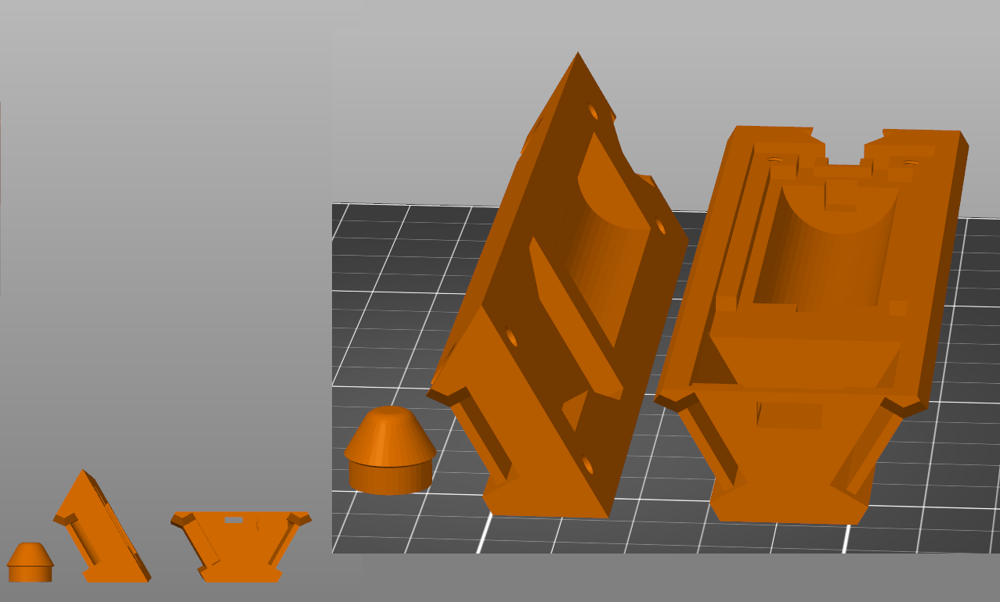
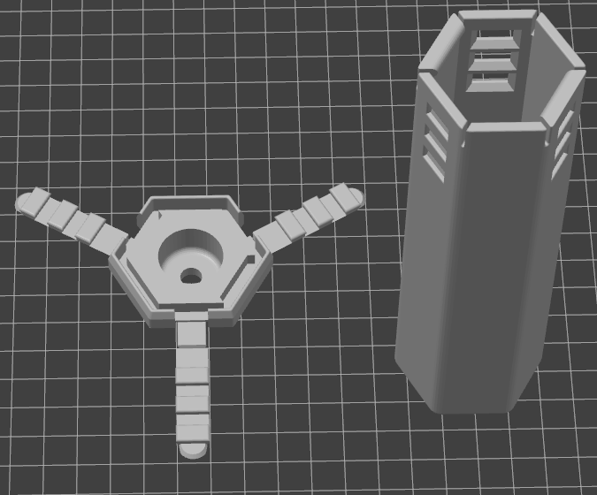

# Open Pixel Poi - 3D Printed Body

## Main Body
Print all the main body parts in **PLA** or any other rigid material. Slicer profiles such as layer height an infill are not important, just make sure you can do the overhangs. The individual body files have been pre-oriented so that no supports/brims/rafts/etc are required, see the section on orientation below to confirm your orientation. You need 1 of each part per poi, or 2 of each for a pair.
###### Main body parts are:
1. [Open Pixel Poi - Body - Top](<https://github.com/Mitchlol/Open-Pixel-Poi/raw/refs/heads/main/Hardware/3D%20Printable%20Body/Open%20Pixel%20Poi%20-%20Body%20-%20Top.3mf>)
1. [Open Pixel Poi - Body - Bottom](<https://github.com/Mitchlol/Open-Pixel-Poi/raw/refs/heads/main/Hardware/3D%20Printable%20Body/Open%20Pixel%20Poi%20-%20Body%20-%20Bottom.3mf>)
1. [Open Pixel Poi - Body - Button](<https://github.com/Mitchlol/Open-Pixel-Poi/raw/refs/heads/main/Hardware/3D%20Printable%20Body/Open%20Pixel%20Poi%20-%20Body%20-%20Button.3mf>)

## Outer Shell
The outer shell must be printed in **Clear / Transparent TPU**. All shell files are preoriented and do not require any supports/brims/rafts/etc, but I reccomend the "avoid crossing perimiters" settings to reduce stringing. See the section on orientation below to confirm your orientation. The shells look nice in 10% gyroid or 3d honeycomb infill IMO. You need 1 shell & 1 cap per poi, so that means 4 parts for a pair.

For the cap, pick whichever version you preffer, they are all cross compatible. If you want a different mounting situation on these caps, and don't know how to model it yourself, send a message in the discord channel, and I can likely help you out.

###### Shells versions are:
1. **25 Pixel (Standard) Shell:** [Open Pixel Poi - Shell - Snap](<https://github.com/Mitchlol/Open-Pixel-Poi/raw/refs/heads/main/Hardware/3D%20Printable%20Body/Open%20Pixel%20Poi%20-%20Shell%20-%20Snap.3mf>)
1. **55 Pixel (HD) Shell:** [Open Pixel Poi - Shell - Snap - 55 Pixel](<https://github.com/Mitchlol/Open-Pixel-Poi/raw/refs/heads/main/Hardware/3D%20Printable%20Body/Open%20Pixel%20Poi%20-%20Shell%20-%20Snap%20-%2055%20Pixel.3mf>)

###### Cap options are:
1. **Snap Cap Flat:** [Open Pixel Poi - Shell Cap - Snap A](<https://github.com/Mitchlol/Open-Pixel-Poi/raw/refs/heads/main/Hardware/3D%20Printable%20Body/Open%20Pixel%20Poi%20-%20Shell%20Cap%20-%20Snap%20A.3mf>)
1. **Snap Cap Tapered:** [Open Pixel Poi - Shell Cap - Snap B](<https://github.com/Mitchlol/Open-Pixel-Poi/raw/refs/heads/main/Hardware/3D%20Printable%20Body/Open%20Pixel%20Poi%20-%20Shell%20Cap%20-%20Snap%20B.3mf>)
1. **Snap Cap Tapered 6.75mm Though-Hole:** [Open Pixel Poi - Shell Cap - Snap C](<https://github.com/Mitchlol/Open-Pixel-Poi/raw/refs/heads/main/Hardware/3D%20Printable%20Body/Open%20Pixel%20Poi%20-%20Shell%20Cap%20-%20Snap%20C.3mf>)

## Orientation
The parts all print without supports when oriented like this. Take special note of orientation the bottom half of the body, the led groove is an overhang rather than requiring supports.

## Extras
The [Extras](./Extras/README.md) folder contains poi knobs, and whatever else seems relevant to upload. Nothing in this folder is required to have a functional poi, but it is worth having a look.

## OldFiles
If you are looking for the older shell files, they are now deprecated, but I dumped them all in the [OldFiles folder](./OldFiles)
