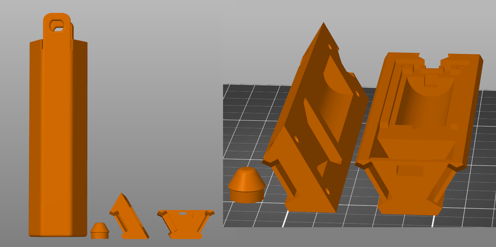

# Open Pixel Poi - 3D Printed Body

## Main Body
Print all the main body parts in **PLA** or any other rigid material. Slicer profiles such as layer height an infill are not important, just make sure you can do the overhangs. The individual body files have been pre-oriented so that no supports/brims/rafts/etc are required, see the section on orientation below to confirm your orientation. You need 1 of each part per poi, or 2 of each for a pair.
###### Main body parts are:
1. [Open Pixel Poi - Body - Top](<Open Pixel Poi - Body - Top.3mf>)
1. [Open Pixel Poi - Body - Bottom](<Open Pixel Poi - Body - Bottom.3mf>)
1. [Open Pixel Poi - Body - Button](<Open Pixel Poi - Body - Button.3mf>)

## Outer Shell
The outer shell must be printed in **Clear / Transparent TPU**. Ive included 2 shell variants. For the original hex shell, I like how it looks with 10% gyroid infill. The round shell should be mostly unaffected by infill, as it has thin walls and internal cavities to control diffusion. Both files are preoriented and do not require any supports/brims/rafts/etc, see the section on orientation below to confirm your orientation. You need 1 shell per poi, so that means 2 shells for a pair. If you're undecided which shell you want, go with the round one.
###### main body parts are:
1. **Option 1:** [Open Pixel Poi - Shell - Hex](<Open Pixel Poi - Shell - Hex.3mf>)
1. **Option 2:** [Open Pixel Poi - Shell - Round Diffused](<Open Pixel Poi - Shell - Round Diffused.3mf>)

## Orientation
The parts all print without supports when oriented like this. Take special note of orientation the bottom half of the body, the led groove is an overhang rather than requiring supports.

## All in one file
Alternatively [Open Pixel Poi - All Parts In One File](<Open Pixel Poi - All Parts In One File.3mf>) contains all the parts of a single poi body. You will need to split the object to seperate out the parts, and orient them on your own.
