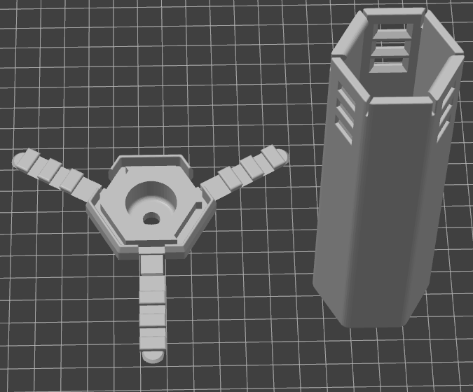

# Snap Lid Shell Page

So, uh, here is the snap in shell page. Things are still somewhat in flux. So every time you print, it's probably best to check if the files have changed. I'm calling it beta for now

Note: that the lid only fits on properly in one out of the six orientations, as the tabs need to line up and there are insets to make room for the bumps on the shell stop the main module body from falling out.

I sometimes use a pry tool (wedge, knife, keys, etc) to get the first snap up, then pull the rest. I also use my poi knob, or a wall, table, surface or edge to smash them back in.

The snap system has a bunch advanatges over the older style shells.
1. The mounting hole prints flat and directly on the print bed allowing for easy modificaion
1. You dont need to mess with your leashes to access the USB port, removing the need for slip knots
1. The sides of the holes on the old design were definitly a weak point, and so far, this seems much stronger
1. The two tabs always line up weird and stagger and its just not cool
1. The old caps were annoying to put on and slid around a lot

If you want a different mounting situation on these caps, and don't know how to model it yourself, send a message in the discord channel, and I can likely help you out (especially if you can make an engineering drawing, or something close enough).

## Files
1. **Standard Shell (W/Snap Holes):** [Open Pixel Poi - Shell - Snap](<https://github.com/Mitchlol/Open-Pixel-Poi/raw/refs/heads/main/Hardware/3D%20Printable%20Body/SnapShell/Open%20Pixel%20Poi%20-%20Shell%20-%20Snap.3mf>)
1. **55 Pixel Shell (W/Snap Holes):** [Open Pixel Poi - Shell - Snap - 55 Pixel](<https://github.com/Mitchlol/Open-Pixel-Poi/raw/refs/heads/main/Hardware/3D%20Printable%20Body/SnapShell/Open%20Pixel%20Poi%20-%20Shell%20-%20Snap%20-%2055%20Pixel.3mf>)
1. **Snap Cap Flat:** [Open Pixel Poi - Shell Cap - Snap A](<https://github.com/Mitchlol/Open-Pixel-Poi/raw/refs/heads/main/Hardware/3D%20Printable%20Body/SnapShell/Open%20Pixel%20Poi%20-%20Shell%20Cap%20-%20Snap%20A.3mf>)
1. **Snap Cap Tapered:** [Open Pixel Poi - Shell Cap - Snap B](<https://github.com/Mitchlol/Open-Pixel-Poi/raw/refs/heads/main/Hardware/3D%20Printable%20Body/SnapShell/Open%20Pixel%20Poi%20-%20Shell%20Cap%20-%20Snap%20B.3mf>)
1. **Snap Cap Tapered 6.75mm Though-Hole:** [Open Pixel Poi - Shell Cap - Snap C](<https://github.com/Mitchlol/Open-Pixel-Poi/raw/refs/heads/main/Hardware/3D%20Printable%20Body/SnapShell/Open%20Pixel%20Poi%20-%20Shell%20Cap%20-%20Snap%20C.3mf>)

## Print Info
The parts all print without supports when oriented like this. I reccomend the "avoid crossing perimiters" setting to help reduce stringing in the main shell print. Ive been using 10% 3D Honeycomb infill just because I like how it looks.

