# Open Pixel Poi Assembly Guide

## intro

This is basic assembly guide, and while assembly should be intuitive, this guide includes a few tips, tricks, and order of operations optimizations. It does not include any soldering specific info, as that is out of scope.

For a realtime assembly video with soldering click [here (video coming eventually)]()

## Step 1: 
###### Gather your parts
For a single poi you will need:
1. 3D Printed outer shell (clear TPU) - 1x
1. 3D Printed body top (PLA) - 1x
1. 3D Printed body bottom (PLA) - 1x
1. 3D Printed button (PLA) - 1x
1. M3 x 8mm Hex Socket Head Cap Screw - 4x
1. 18650 Li-Ion battery - 1x
1. Open Pixel Poi PCB - 1x
1. WS2812b 144/m adhesive back stip 20 leds long (no waterproofing) - 3x
1. 26 AWG Silicone Stranded wire 2.75" long - 9x (3 colors, 3 of each)

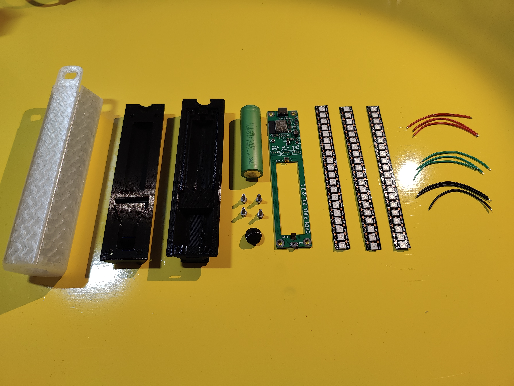

## Step 2
###### Solder wires to the LED strips
While any color will work, using the right color keeps things neat!
Black = ground
Red = power
Any other color =  data

## Step 3
###### Solder 2 LED strips to the top of the board
One strip to each of the 2 outer connection points.
You can thread the wires thorugh the holes if you like, but if you don't,
make sure they go away from the battery and towards the USB port.

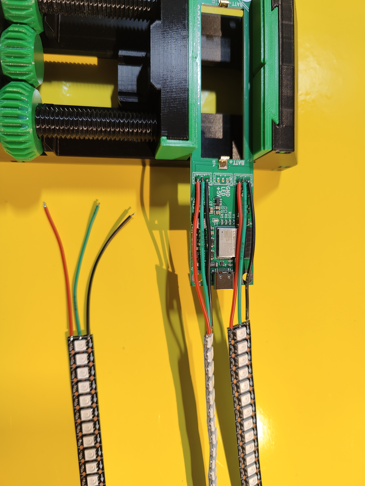

## Step 4
###### Solder the 3rd LED strip to the bottom of the middle connection
Same as step 3, just using the middle connection on the bottom side of the board.

## Step 5
###### Thread 2 LED strips through the top part of the poi body
The top body part is the one with holes for 2 led strips!
You need to bend them a little to get it through, but you can do it!
Take note that they aren't crossed, and that they are twisted the right way to point outward when folded down.
You can twist the wiring later if you get it wrong, but it is a pain.
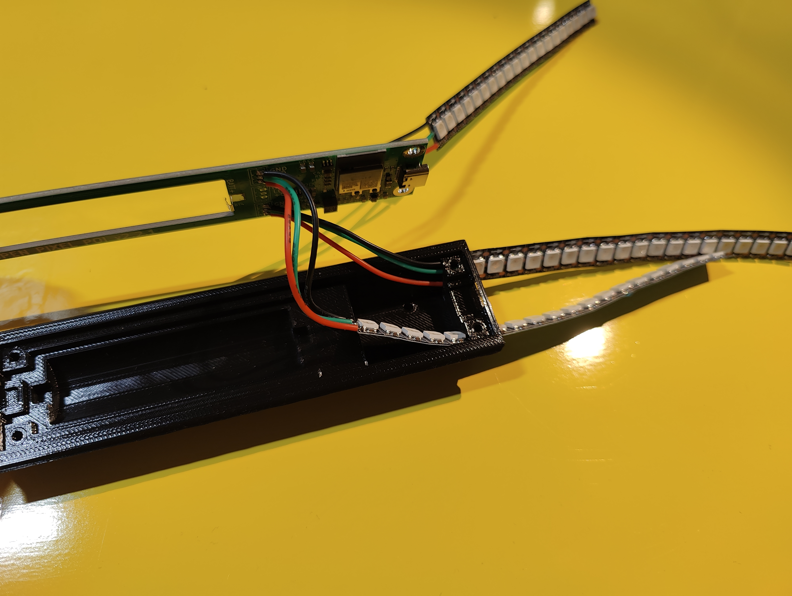

## Step 6
###### Insert the battery into the top of the body
Push the battery into the body, making sure the positive end is towards the USB port, and lines up with the batt+ label on the board.
It is a tight fit, this is intentional.
It goes in easiest if you slide it in all at once, rather than one end first.
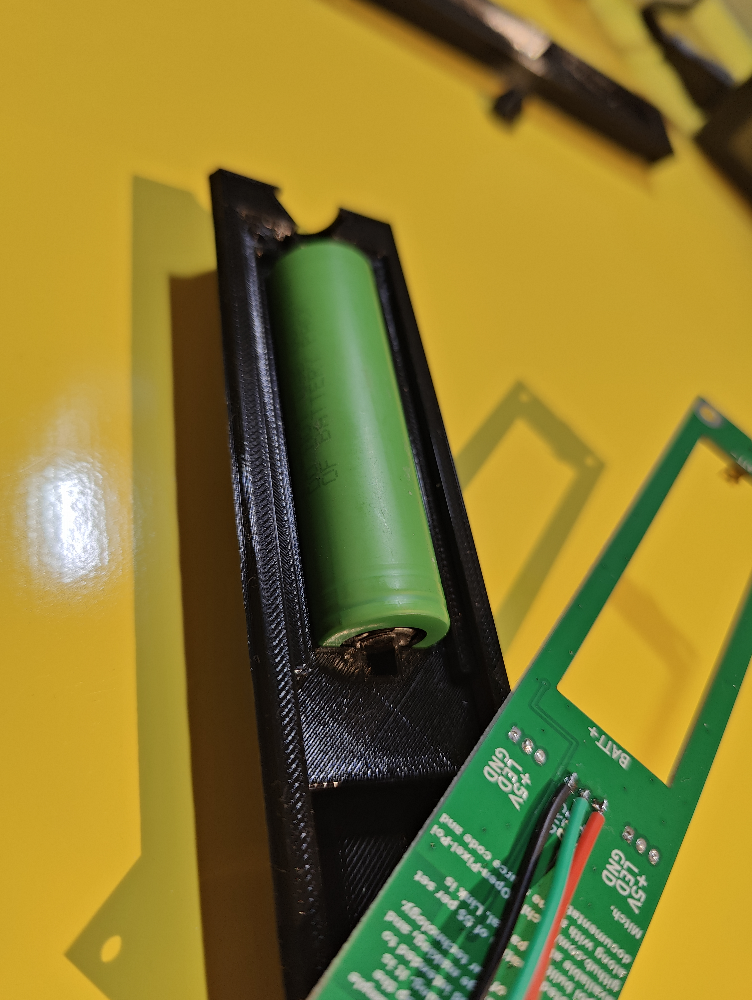

## Step 7
###### Slot in the PCB
Order is important here.
First slide the usb port into the usb port hole at the top of the poi, while keeping the switch end of the board elevated.
Then, carefully lever down the board over the battery, this will turn the poi on.
Finally, make sure the bottom (and sides) of the pcb are fully seated and flush with the body.
This is often tight as well and may snap in.
You can turn the poi off with the switch see the [user manual]()
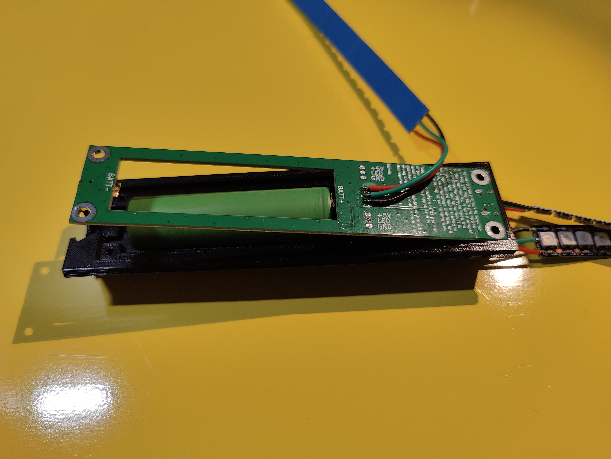

## Step 8
###### Snap the button into body
Push the button into the body, it is a snap fit.
**Take extra care to avoid contact with the switch on bottom of the board!**
**It can break easy.**
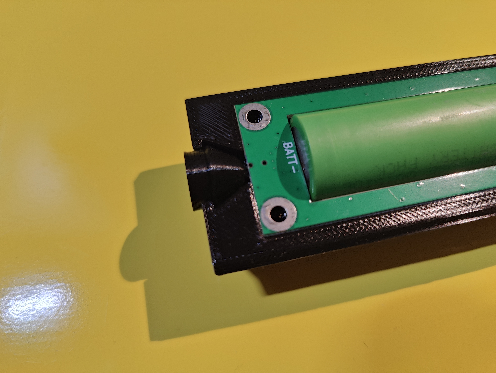

## Step 9
###### Thread the 3rd led strip through the bottom of the body
Same as the first 2, but easier, make sure it is twisted the right way.
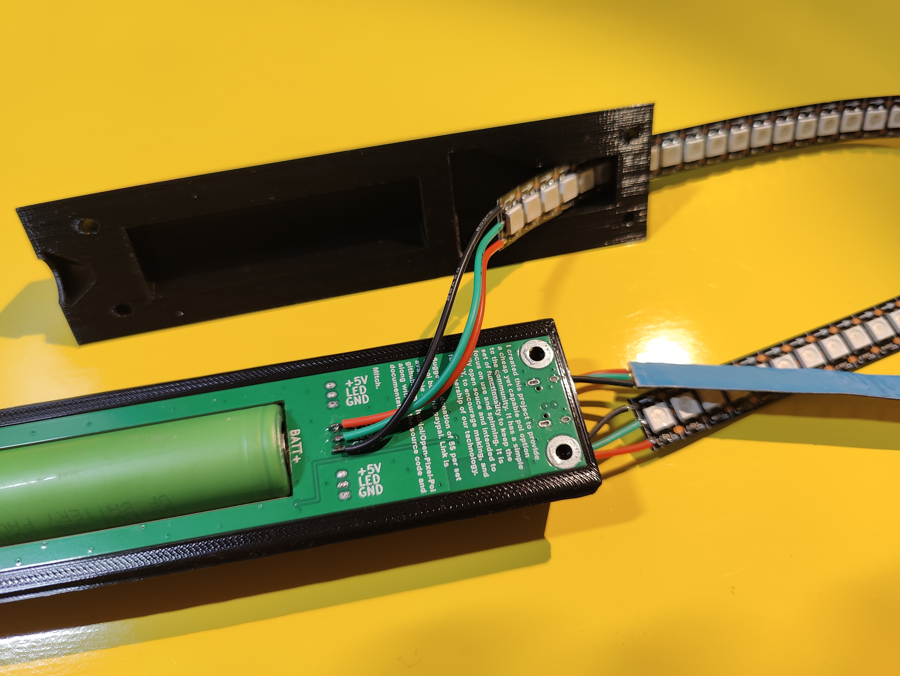

## Step 10
###### Push the 2 body halves together
Once again, the battery is snug. Make sure no wires get pinched.
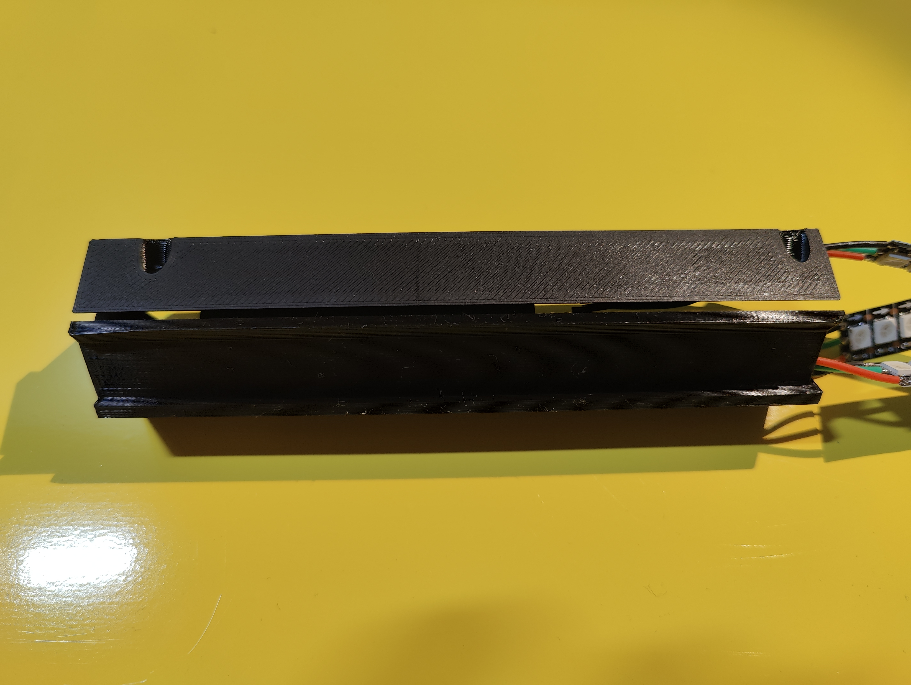

## Step 11
###### Screw the two halves together
These screws are going directly into a 3d print, so be gentle, you don't want to strip the threads. You can hold it up to the light to make sure there is no visible gap between the 2 halfs, to know it is snug.

Alternativley, you can just wrap the sucker in packing tape, just make sure you do it after sticking on the LEDs.
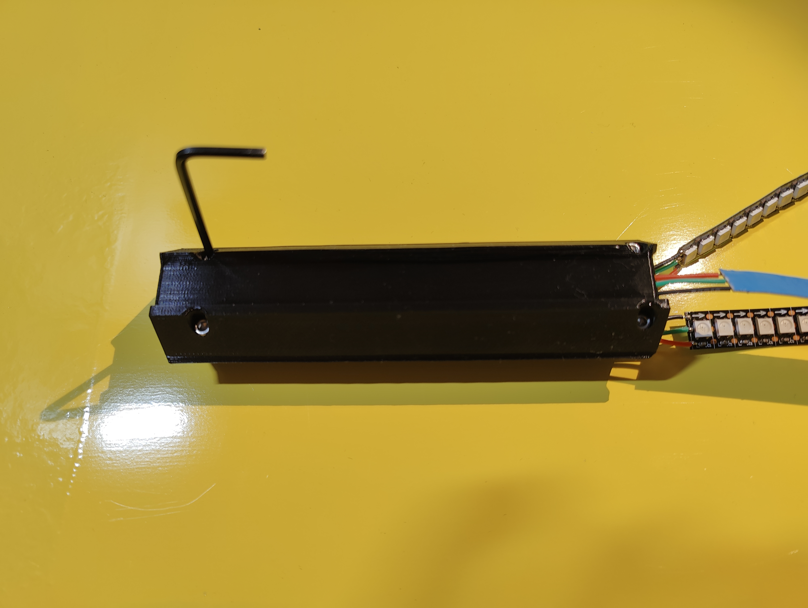

## Step 12
###### Apply the LED strips
Peel the backing off the LED strips, and apply to the to body. 
One for each recess. 
Start from the bottom of the poi and work back towards the wiring. 
If you cut the bottom of the strip flush with the bottom LED, it should line up perfectly.
Do this for all 3 strips.
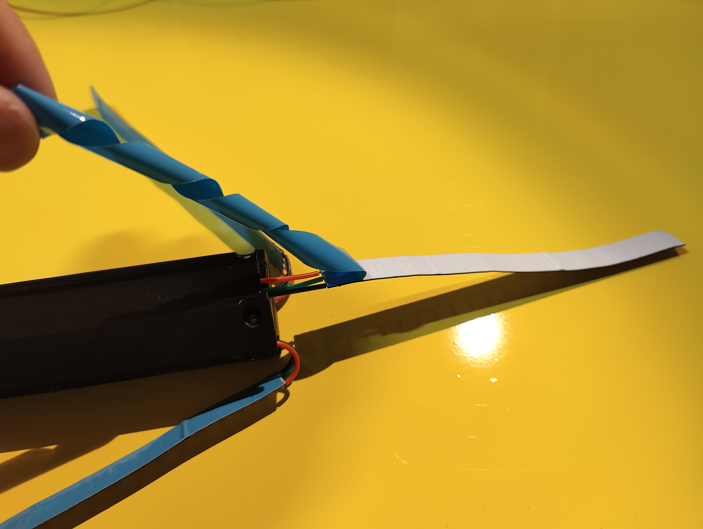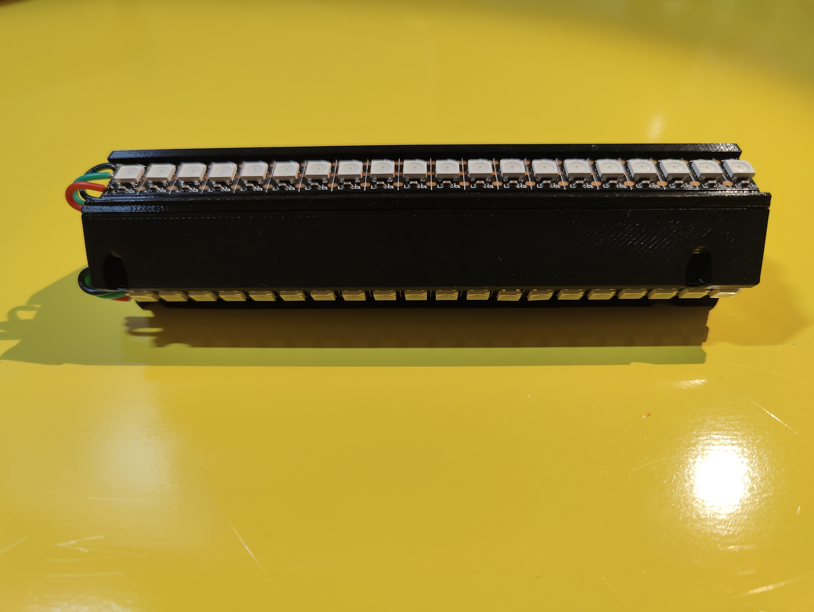

## Step 13
###### Tuck excess wireing into the body
Using blunt tweezers makes light work of this.
I tuck the 2 top strips away from the exposed screws.
I don't think they can move enough to wear thorugh and cause a short. But you can add a dab of hot glue to ease your mind if you wish.

## Step 14
###### Slot the body into the shell
Pull the two longer tabs apart to get the clearnace needed.
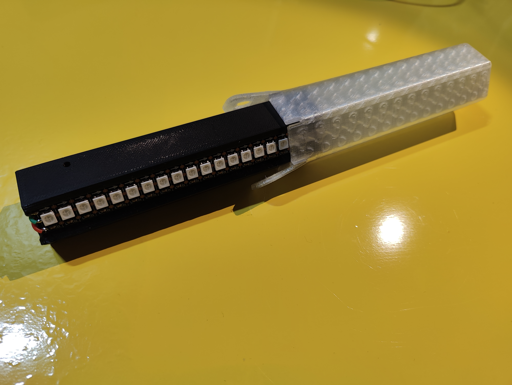

## Step 15
###### Party!
Woah! Where did that 2nd poi come from?

