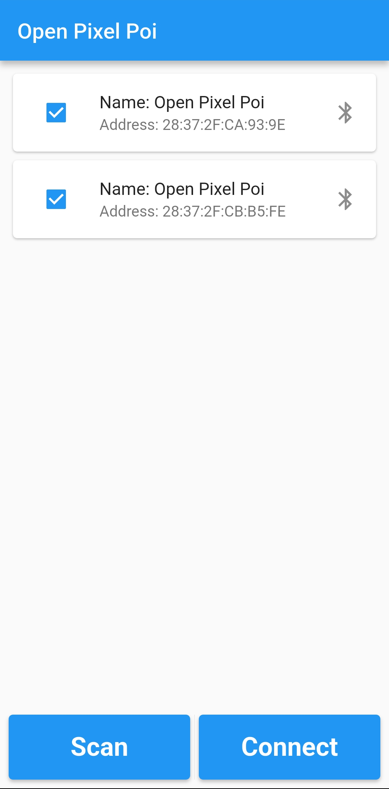
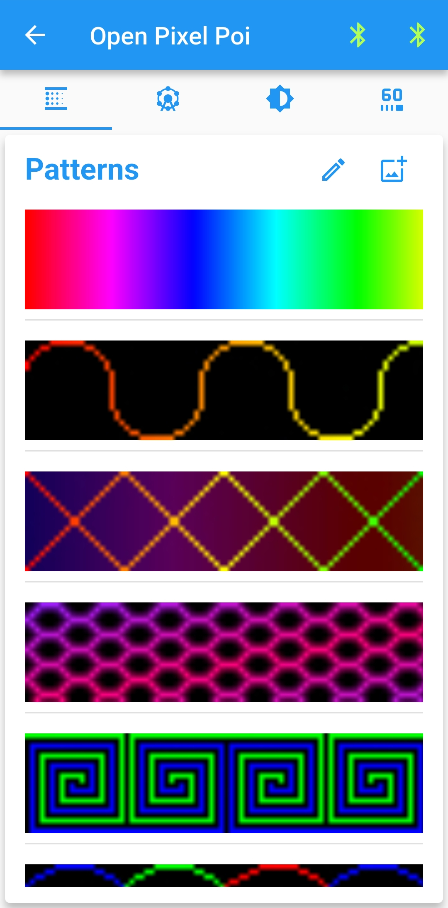
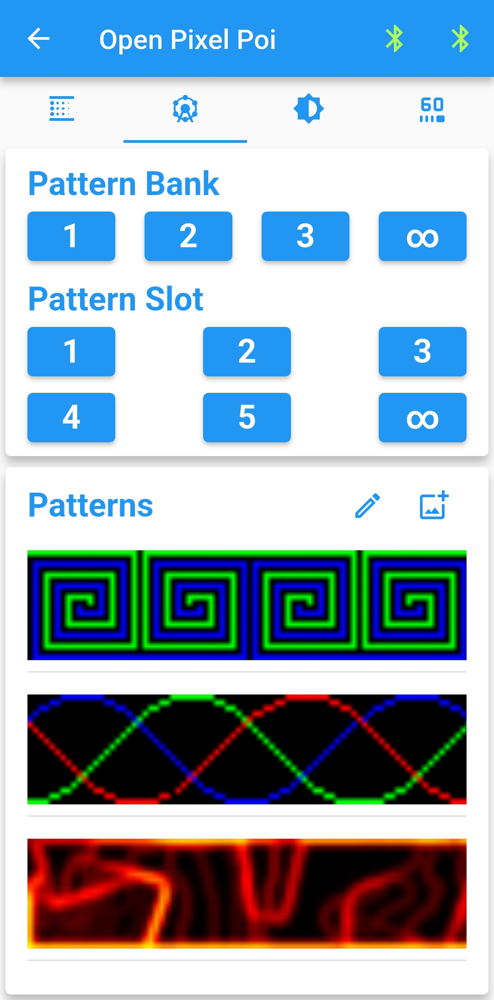
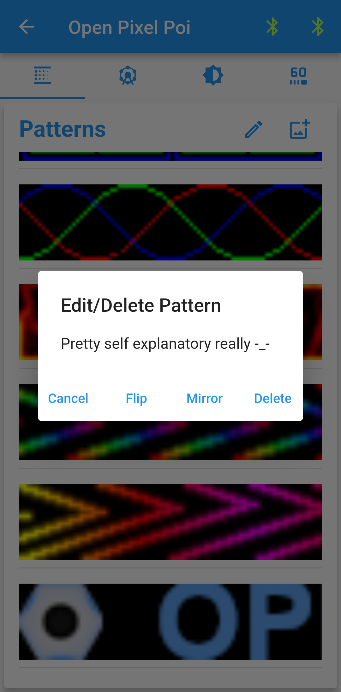
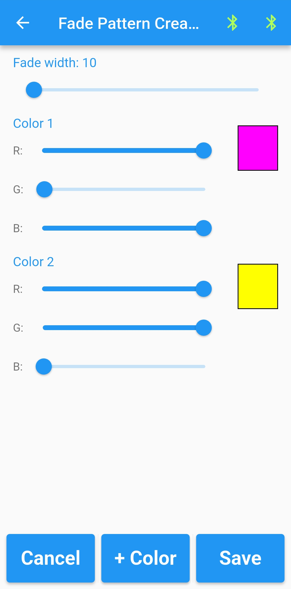

# Open Pixel Poi Software

## About
This app is written using flutter, a multi-platform framework. It is designed to run on mobile sized screens, but will work on anything. Currently, I have built the app for [Android](#android-releases), [Windows](#windows-releases), and [Web](#web-releases).

This app is the only way transmit patterns to the poi hardware.

All patterns are images. To import a new pattern to the app, it must be smaller than or equal to 20x400px and a bitmap/png/jpg format. Then simply tap/click/etc the pattern to overwrite the currently active pattern on all connected poi.

###### Tips & Tricks
- Select multiple devices to connect to multiple devices.
- Long press scan to proceed to app without any connections.
- Long press a pattern to see it's size, or delete/flip/mirror it.
- Selecting the ∞ pattern slot will trigger auto pattern looping.
- Long press the app name on the patterns page to enter the secret device settings page.
- The text pattern creation input only accepts capital letters.
- When creating stacked patterns, be mindful of the widths, if the least common multiple is greater than 400, it will crop.
- Buy a \$2000 macbook, a \$1000 iphone and a dev license to build the app for iOS.

## Android Releases
###### ⚠️Uninstall the app  before switching versions.⚠️
[Open Pixel Poi v2.0.0](https://github.com/Mitchlol/Open-Pixel-Poi/raw/refs/heads/main/Software/open_pixel_poi_v2.0.0.apk)
[Open Pixel Poi v1.0.0](https://github.com/Mitchlol/Open-Pixel-Poi/raw/refs/heads/main/Software/open_pixel_poi_v1.0.0.apk)

## Windows Releases
[Open Pixel Poi v1.0.0](https://github.com/Mitchlol/Open-Pixel-Poi/raw/refs/heads/main/Software/open_pixel_poi_windows_v1.0.0.zip)

## Web Releases
Note: 
- Web use may require a poi [firmware update](https://mitchlol.github.io/#openpixelpoi)
- Additionally, web bluetooth api is limited to a single device connection at a time.
- Also, it is unspported on iOS 🤦‍♂️.

[Open Pixel Poi Webapp](https://mitchlol.github.io/opp_flutter_app/index.html)
